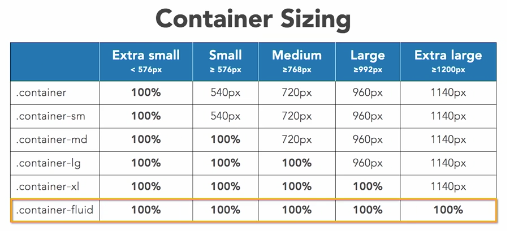

# Mastering layout with Bootstrap

 Bootstrap uses a 12 column grid breakpoints system.

   1. Extra small
   2. small
   3. medium
   4. large
   5. extra large

## using containers

1. responsive 12 column container
2. flexbox based
3. `container`, `row`, `column` three classes
    1. `.container(-SIZ)`
        - SIZ: sm, md, lg,xl,fluid
    2. They all have each side of 15px padding
    3. containers have different break point. 

## Rows/Coloums

1. Rows:
   1. needs the class of `row`
   2. more details: `row-cols(-BP)(-COL)
      1. BP: sm > 576px, md > 768px and so on
      2. COL: 1-6
   3. Delete space between use `no-gutters`
2. Columns
   1. up to 12 columns
   2. `col(-BP)(-COL)`
      1. BP: sm > 576px, md > 768px, etc
      2. COL: 1-12
3. Aligning columns
   1. **Vertical**
      1. `align-TYP-DIR`
         1. TYP: items, self
         2. DIR: start, center, end
         3. Don't forget to add a `VH-100` first, means view point 100%.
   2. **Horizontal**
      1. `justify-content-DIR`
         1. DIR: start, center, end, around, between

## Offset columns

1. offset-BP-COL
   1. BP: sm > 576px, md > 768px etc
   2. COL: 1-11
   3. This is used to adjust the position of the col

## Nesting

- `row` inside column
- creates 12-col grid
- use same classes

## Customizing Order

- `order(-BP)-ORD`
  - BP: sm > 576px, md > 768px etc
  - ORD: 1-12
  - if you gonna change the order of elements, change all of them.
- `d-flex, flex-column`
  - add these two to the .col will bring adjustability to it's children elements.
  - then you can use .order in child element.

## alignment

1. vertical alignment
   1. use in rows
   2. `align-item-ALN`
      1. ALN: start, center, end
   3. works on nested cols
2. indidual alignment
   1. use in cols
   2. `align-self-ALN`
      1. ALN: same as above
3. Horizontal Alignment
   1. use in rows, or horizontal containers
   2. need col width
   3. `justify-content-ALN`
      1. ALN: start, center, end, around, between

## Position

1. Position classes
     - `fixed-top`
     - `fixed-bottom`
     - `sticky-top`
        - `Sticky-top` lacks support
2. Basic Display
   1. Minics CSS
   2. `d(-BP)-TYP`
      1. BP: sm > 576, 768,992,1200 etc
      2. TYP: none, inline, inline-bock, block, table, table-row, table-cell, flex, inline-flex
3. Print Display
   1. `d-print-TYP`
      1. TYP: none, inline, inline-bock, block, table, table-row, table-cell, flex, inline-flex
   2. This controls whether the content will be printed to paper
4. Basic Flex Container
   1. `d(-BP)(-inline)-flex`
      1. BP: sm > 576, 768, 992, 1200 etc

## options with flex container

1. you can add classes to the container, which modifies every items inside of it, or add item level classes to adjust individual items.
2. Direction
   1. `flex(-BP)(-DIR)(-reverse)`
      1. BP: sm > 576 etc
      2. DIR: row, column
3. Order
   1. `order(-BP)-ORD`
      1. BP: same thing
      2. ORD: 1-12
4. Justify
   1. `justify-content(-BP)-ALG`
      1. BP: same
      2. ALG: start, end, center, around, between
5. Wrap
   1. `flex(-BP)-WRP(-reverse)`
      1. BP: same thing
      2. WRP: wrap, nowrap
6. vertical alignment
   1. `align-content(-BP)-ALG`
      1. BP: same
      2. ALG: start, end, center, between, around, stretch

## Individual Flex Elements

1. Align self
   1. `align-self(-BP)-ALG`
      1. BP: same
      2. ALG: same 5 things
2. Controlling order
   1. `order(-BP)-ORD`
      1. BP: same break point
      2. ORD: 1-12

## Floating Elements

1. Floating Elem
   1. `float-(PB)-SID`
      1. BP: same ting
      2. SID: left, right, none

## Margin/Padding

1. `PROSID(-BP)-(N)SIZ`
   1. PRO: **m** Margin **p** padding
   2. SID: t, r, b, l, x, y
   3. BP: same deal
   4. SIZ: 0-5, auto, (in rem, 1: 0.25 rem, 2: 0.5 rem, 3: 1 rem, 4: 1.5 rem, 5: 3 rem)
   5. N: negitive (n), only works with margin, not padding
   6. eg.: mt-n5 margin-top set to negative 5; pt-5 padding-top set to 5;

## visibility

1. `invisible, visible` 
   1. when invisible, still occupy the place
2. `d(-BP)-TYP`
   1. BP: you know it
   2. TYP: none, none, inline, inline-bock, block, table, table-row, table-cell, flex, inline-flex;

## Sizing

1. `SIZ(-AMT)`
   1. SIZ: w, h, mw, mh, vw, vh, min-vw, min-vh
   2. AMT: 25, 50, 75, 100, auto

## Borders

- `BORDER(-SID)(-COL)(-0)`
  - SID: top, right, bottom, left
  - COL: primary, secondary, success, danger, warning, info, light, dark, white

- `ROUNDED(-SID)(-SHA)(-SIZ)`
  - SID: as above
  - SHA: circle, pill
  - SIZ: 0, sm, lg