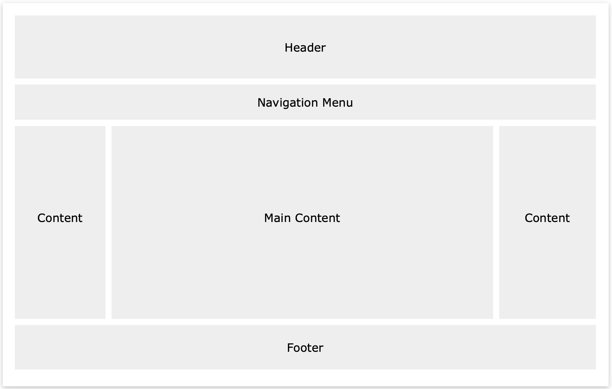

## [Back to Homepage](https://pengchen11.github.io/reading-notes/readme.md)

# CSS Website Layout
A website is often divided into headers, menus, content and a footer:  

There are tons of different layout designs to choose from. However, the structure above, is one of the most common, and we will take a closer look at it in this tutorial.